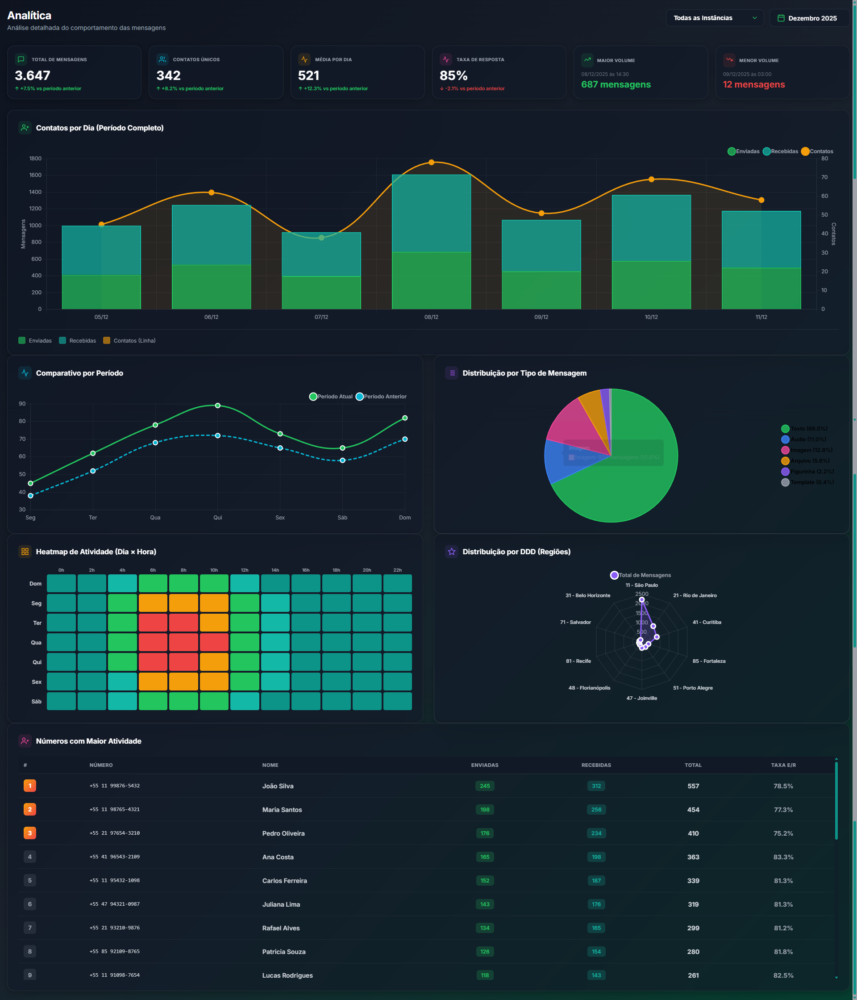
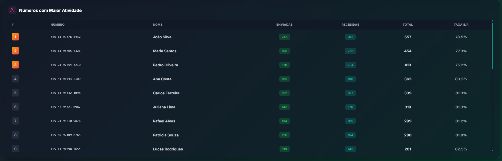

# 📊 Analytics Dashboard - Portfolio Showcase

> Dashboard moderno de análise de mensageria com design glassmorphism dark mode

---

## 🖼️ Preview

### Dashboard Completo

### Cards de Métricas e KPIs

### Métricas e Volumetria

### Gráfico de Volume por Dia

---

## ✨ Features

- **6 Cards de Métricas** - Total de mensagens, contatos únicos, média, taxa de resposta, maior/menor volume
- **Gráficos Interativos** - Contatos por dia, comparativo, distribuição por tipo, heatmap, radar DDD
- **Filtros Inteligentes** - Por mês e instância
- **Design Responsivo** - Desktop, tablet e mobile
- **Scrollbar Customizada** - Gradiente teal com efeito hover

---

## 🛠️ Stack Tecnológica

- **HTML5** - Estrutura semântica
- **CSS3** - Glassmorphism, Grid, Flexbox
- **JavaScript ES6+** - Vanilla JS
- **Chart.js** - Visualização de dados
- **Flatpickr** - Date picker customizado

---

## 💼 Contato

Interessado em conhecer mais sobre o projeto ou contratar serviços similares?

📧 **Email:** gabfett@gmail.com
💼 **LinkedIn:** https://www.linkedin.com/in/gabriel-fett/  

---

## ⚠️ Nota

Este é um **protótipo de interface** desenvolvido para demonstração de habilidades técnicas. O código-fonte é proprietário. Todos os dados são fictícios.

**© 2025 - Todos os direitos reservados**
